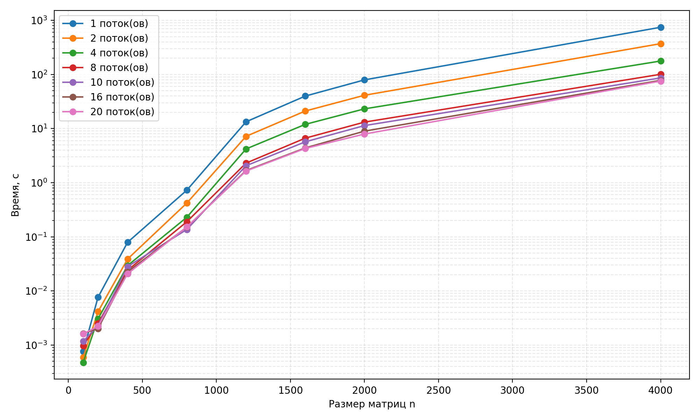

**Задание на лабораторную работу 2**

Модифицировать программу из л/р №1 для параллельной работы по технологии OpenMP.  Провести серию экспериментов с разным количеством потоков (1, 2, 4, 8 и т.д.), разными размерами матриц (примерно 200, 400, 800, 1200, 1600, 2000), с разным количеством вычислительных ядер при наличии технической возможности (1, 2, 4, 8 и т.д. ), иначе использовать фиксированное существующее количество вычислительных ядер, например 4.

---

## Ход работы

В ходе работы код с 1 лабораторной работы был адаптирован код с 1 ЛР для работы с OpenMP.
Были проведены тесты для различного числа потоков процессора

---
## Оборудование

Все тесты проводились на процессоре 
Intel(R) Xeon(R) CPU E5-2666 v3 @ 2.90GHz. Вот его характеристики

Компилировалось и запускалось всё это дело в Visual Studio Community Edition 2022

Версия OpenMP 2.0 - потому что старенький уже вс у меня

Все необходимые флаги для компиляции были выставлены в настройках приложения

---
## Тесты

В ходе работы проводились тесты для различных размеров матриц на 1,2,4,8,10,16,20 потоках

Размеры матриц были 100,200,400,800,1200,1600,4000

| Размер матриц          | 100        | 200        | 400        | 800        | 1200       | 1600       | 2000       | 4000       |
|------------------------|------------|------------|------------|------------|------------|------------|------------|------------|
| Кол-во операций        | 2,00E+06   | 1,60E+07   | 1,28E+08   | 1,02E+09   | 3,46E+09   | 8,19E+09   | 1,60E+10   | 1,28E+11   |
| 1 поток, время s       | 7,615E-04  | 7,616E-03  | 7,921E-02  | 7,265E-01  | 1,333E+01  | 3,982E+01  | 7,934E+01  | 7,440E+02  |
| 2 потока, время s      | 5,895E-04  | 4,138E-03  | 3,887E-02  | 4,196E-01  | 7,183E+00  | 2,108E+01  | 4,123E+01  | 3.704e+02  |
| 4 потока, время s      | 4,768E-04  | 3,035E-03  | 2,940E-02  | 2,296E-01  | 4,200E+00  | 1,195E+01  | 2,313E+01  | 1.770e+02   |
| 8 потоков, время s     | 9,703E-04  | 2,499E-03  | 2,406E-02  | 1,897E-01  | 2,299E+00  | 6,647E+00  | 1,316E+01  | 1.006e+02  |
| 10 потоков, время s    | 1,170E-03  | 2,271E-03  | 2,818E-02  | 1,363E-01  | 2,056E+00  | 5,686E+00  | 1,135E+01  |  8.625e+01 |
| 16 потоков, время s    | 1,636E-03  | 2,015E-03  | 2,249E-02  | 1,510E-01  | 1,677E+00  | 4,384E+00  | 8,963E+00  | 7.771e+01  |
| 20 потоков, время s    | 1,605E-03  | 2,217E-03  | 2,078E-02  | 1,522E-01  | 1,641E+00  | 4,288E+00  | 7,925E+00  | 7.543e+01  |

---
## Графики

График зависимости времени, затраченного на перемножение матриц
По вертикали время, каждая точка - увеличение количества потоков
по горизонтали размер

---

## Выводы по экспериментам

Смотря на таблицу и графики, можно понять, что при малом количестве операций многопоточность
только задерживает выполнение программы

Напротив, при большом количестве данных - время, затраченное на перемножение матриц уменьшается
с увеличением числа потоков

---

## Итоги

В ходе выполнения этой лабораторной работы я выяснил, как работать с OpenMP
и провел тесты многопоточной программы для разного числа потоков
