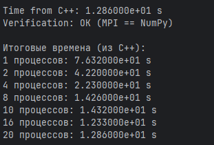
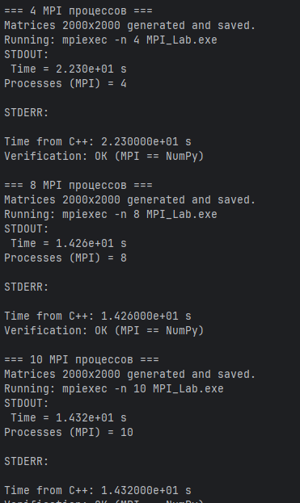
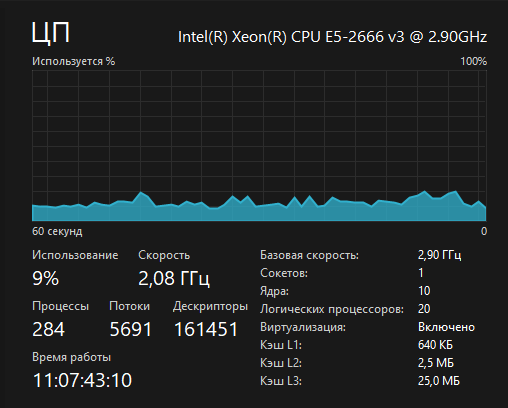
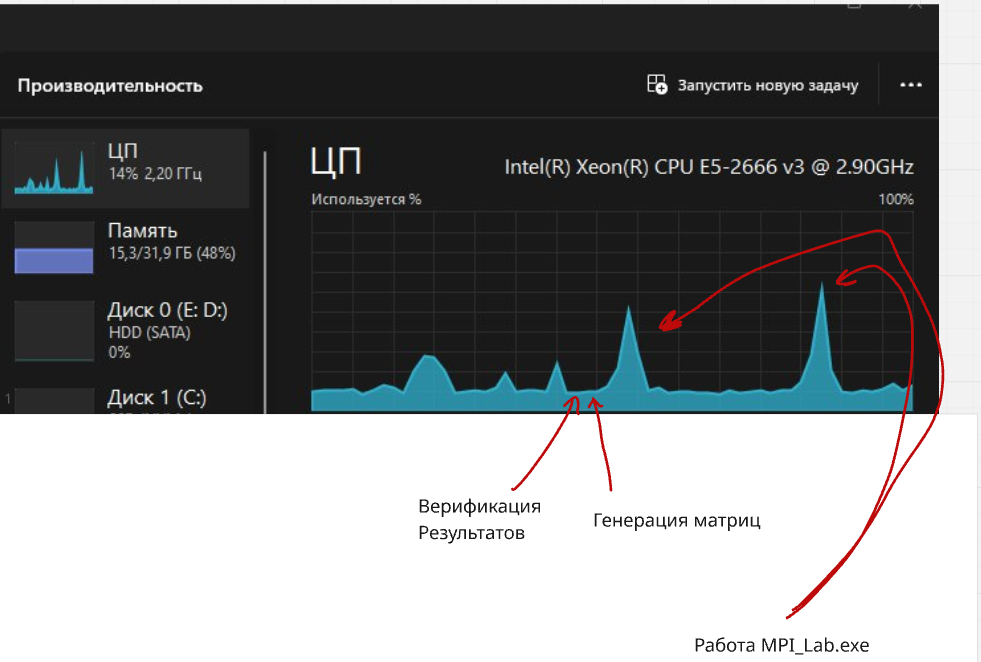

# Задание на лабораторную работу 3

Модифицировать программу из л/р №1 для параллельной работы по технологии MPI. Провести серию экспериментов с разными размерами матриц (примерно 200, 400, 800, 1200, 1600, 2000), с разным количеством вычислительных ядер (1, 2, 4, 8 и т.д.).

---

## Ход работы

В ходе работы код с 1 лабораторной работы был адаптирован код с 1 ЛР для работы с MPI.
Были проведены тесты для различного числа потоков процессора

Для выполнения работы необходимо собрать код из `main.cpp` с поддержкой MPI. 

Запуск программы осуществляется командой PowerShell `mpiexec -n X MPI_Lab.exe`, где `x` - количество процессов,
а `MPI_Lab.exe` - имя собранного main.cpp

Модуль `main.py` автоматически запускает `MPI_Lab.exe` для разного количества процессов
и фиксированного размера матриц. Модуль действует по следующему паттерну:

Генерация матриц `->` запуск `MPI_Lab.exe` `->` верификация результатов через `numpy` 
`->` Повторение того же для другого количества процессов

В `main.py` можно задать такие переменные, как 

`MATRIX_SIZE = 2000` - размер генерируемых матриц 2000х2000 (в ходе работы я это менял для теста)

`PROCS = [1, 2, 4, 8, 10, 16, 20]` - Количество процессов, с которыми будет запущена программа `MPI_Lab.exe`

`EXE_NAME = "MPI_Lab.exe"` - задается название собранного exe файла

Вывод программы:

Вывод программы по конкретному количеству процессов

---
## Оборудование

Все тесты проводились на процессоре 
Intel(R) Xeon(R) CPU E5-2666 v3 @ 2.90GHz. Вот его характеристики

---

### Краткое описание работы main.cpp

- Программа инициализирует MPI, получает `rank` и общее число процессов, процесс с `rank = 0` считается главным.  
- На процессе 0 из файлов считываются две квадратные матрицы, проверяется их размер, он рассылается всем процессам.  
- Матрица A делится по строкам между процессами: каждому отдаётся свой блок строк, данные пересылаются через коллективный вызов рассылки.  
- Полная матрица B рассылается всем процессам, после чего каждый процесс перемножает свой кусок A с B и формирует свой фрагмент результата.  
- Готовые фрагменты результирующей матрицы собираются на процессе 0 в одну матрицу, результат записывается в файл, измеряется и выводится время выполнения и число процессов, затем MPI корректно завершается.

---
## Наблюдения

Пока тестировал для разных размеров матриц, заметил интересную картину, которая показывает, 
что распараллеливание действительно работает

Выходит, что большую часть времени работы занимала генерация матриц и верификация

---
## Тесты

В ходе работы проводились тесты для различных размеров матриц на 1,2,4,8,10,16,20 процессов

Размеры матриц были 100,200,400,800,1200,1600,4000

| Размер матриц             | 100        | 200        | 400        | 800        | 1200       | 1600       | 2000       | 4000       |
|---------------------------|------------|------------|------------|------------|------------|------------|------------|------------|
| Кол-во операций           | 2,00E+06   | 1,60E+07   | 1,28E+08   | 1,02E+09   | 3,46E+09   | 8,19E+09   | 1,60E+10   | 1,28E+11   |
| 1 процесс, время s        | 4,719E-02  | 9,727E-02  | 3,017E-01  | 1,389E+00  | 1,558E+01  | 3,859E+01  | 7,632E+01  |7.761000e+02            |
| 2 процесса, время s       | 5,968E-02  | 1,055E-01  | 2,598E-01  | 9,269E-01  | 8,341E+00  | 2,205E+01  | 4,220E+01  |4.040000e+02            |
| 4 процесса, время s       | 4,280E-02  | 9,439E-02  | 2,748E-01  | 8,708E-01  | 4,839E+00  | 1,211E+01  | 2,230E+01  |1.966000e+02            |
| 8 процессов, время s      | 4,458E-02  | 1,146E-01  | 2,456E-01  | 8,227E-01  | 3,417E+00  | 7,709E+00  | 1,426E+01  |1.259000e+02            |
| 10 процессов, время s     | 5,410E-02  | 1,068E-01  | 2,517E-01  | 8,422E-01  | 3,131E+00  | 6,989E+00  | 1,432E+01  |1.117000e+02            |
| 16 процессов, время s     | 4,331E-02  | 1,040E-01  | 2,172E-01  | 8,073E-01  | 3,038E+00  | 6,751E+00  | 1,233E+01  |1.055000e+02            |
| 20 процессов, время s     | 4,614E-02  | 1,086E-01  | 2,792E-01  | 8,635E-01  | 2,880E+00  | 6,798E+00  | 1,286E+01  | 1.088000e+02           |

---
## Графики

График зависимости времени, затраченного на перемножение матриц
По вертикали время, каждая точка - увеличение количества потоков
по горизонтали размер

---

## Выводы по экспериментам

Смотря на таблицу и графики, можно понять, что при малом количестве операций многопоточность
только задерживает выполнение программы

Напротив, при большом количестве данных - время, затраченное на перемножение матриц уменьшается
с увеличением числа потоков

Если сравнить результаты с OpenMP, то мы получим немного странную картину -
если там результаты для 4к матриц отличались очень сильно для 1 и 20 потоков, то тут для 1 и 20 процессов
они отличаются не так сильно

---

## Итоги

В ходе выполнения этой лабораторной работы я выяснил, как работать с MPI, собрал и автоматизировал
проект. Сделал автоматическую верификацию 
и провел тесты программы для разного количества процессов
