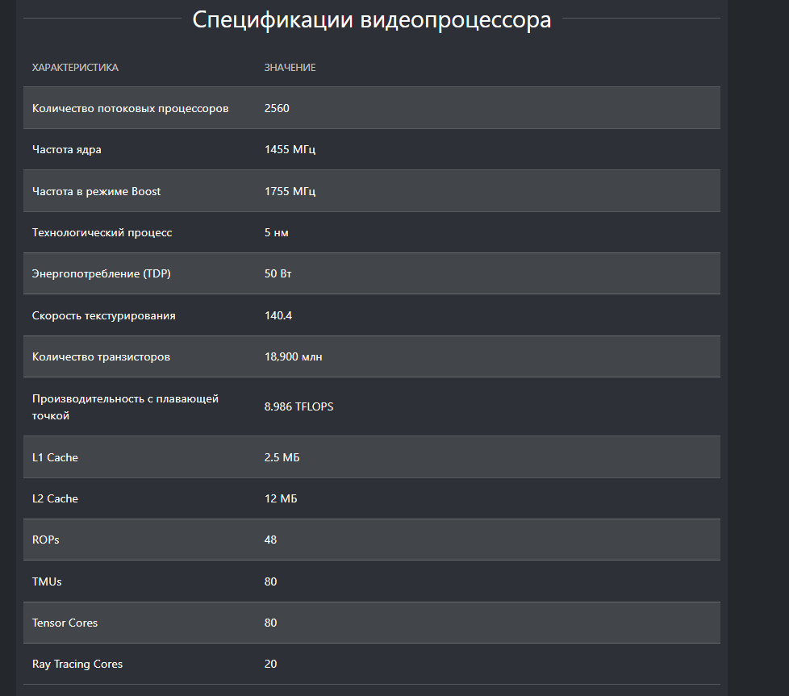
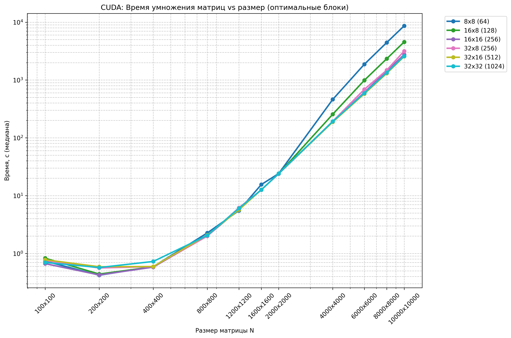

# Задание на лабораторную работу 4

Модифицировать программу из л/р №1 для параллельной работы по технологии CUDA. Провести эксперименты с разными размерами матриц и различными конфигурациями сетки блоков.


---

## Ход работы

В ходе работы код с 1 лабораторной работы для работы с CUDA.
Были проведены тесты для разных конфигураций сетки блоков и размеров матриц

Для выполнения работы необходимо собрать код из `main.cu`

`CUDALab.exe` запускается так:
`CUDALab.exe n x y`, где `n` - размер квадратной матрицы, `x` - количество блоков по координате `x`
`y` - количество блоков по координате `y`

Для автоматизации проведения тестов используется модуль `main.py` - который запускает
`CUDALab.exe` с разными параметрами

В `main.py` можно задать такие настройки, как 

`BLOCK_CONFIGS` - массив, содержащий конфигурации сетки блоков

`REPEATS` - количество выполнений программы `CUDALab.exe`. Требуется, чтобы замерить 
усредненное время выполнения программы

`EXE_PATH` - путь до `CUDALab.exe`

`N` - размер матриц, которые будут генерироваться и перемножаться


Вывод `main.py`:

```
CUDA: 8000x8000
==================================================
Повторов: 3

Прогрев...
Блок    Потоков Среднее Медиана
-----------------------------------
8x8     64      4461.7767       4456.4200
16x8    128     2338.4167       2338.4500
16x16   256     1431.7433       1431.6100
32x8    256     1485.1333       1484.7000
32x16   512     1308.2633       1307.1400
32x32   1024    1339.3600       1341.2700
```

В таблицу с тестами были включены только медианные значения

Верификация результатов производилась для матриц небольшого размера при помощи модуля 
`verify.py` - который я взял с лабораторной работы №3 (можете найти ее на почте, или в этом репо)

---
## Оборудование

Тесты проводились на ноутбучной версии видеокарты `NVIDIA RTX 4050` (т.к возникили 
проблемы с установкой CUDA на мою старую видеокарту)

Характеристики `NVIDIA RTX 4050`



---

### Краткое описание работы main.cu

Краткое описание работы main.cu
Инициализация CUDA: cudaSetDevice(0), создание cudaEvent для замера времени, проверка RTX 4050.

Генерация данных: Матрицы A, B (float) размером N×N на GPU через cudaMalloc, заполнение случайными значениями (curandGenerateUniform).

Настройка сетки: 6 конфигураций блоков (8×8, 16×8, 16×16, 32×8, 32×16, 32×32) → dim3 block(dim_x, dim_y), grid = (N+dim_x-1)/dim_x.

Запуск kernel: matrixMulKernel<<<grid, block>>>(d_A, d_B, d_C, N) — каждый поток (tx,ty) вычисляет C[ty*N+tx] = sum(A[ty*N+i] * B[i*N+tx]).

Замер времени: 1 прогрев + 5 повторов → cudaEventElapsedTime → среднее + медиана.

Верификация: Сравнение с cublasSgemm → max(abs(C_ref - C))/max(abs(C_ref)) < 1e-6.

TFLOPS: 2.0 * N*N*N / (mediana_ms / 1000) / 1e12.

Вывод: Таблица в консоль, очистка памяти cudaFree.


---
## Тесты

В ходе работы проводились тесты для различных конфигураций сетки блоков и различных 
размеров матриц. В таблицах указано время в миллисекундах

### Тесты с матрицами, размером до 1600

| Сетка блоков | 100x100 | 200x200 | 400x400 | 800x800 | 1200x1200 | 1600x1600 |
| ------------ | ------- | ------- | ------- | ------- | --------- | --------- |
| 8x8 (64)     | 0.7363  | 0.4203  | 0.5912  | 2.2640  | 5.5134    | 15.5590   |
| 16x8 (128)   | 0.8274  | 0.4402  | 0.5870  | 1.9971  | 6.0133    | 12.6792   |
| 16x16 (256)  | 0.6666  | 0.4250  | 0.5803  | 2.0092  | 5.7833    | 12.6050   |
| 32x8 (256)   | 0.7567  | 0.5615  | 0.5922  | 1.9958  | 6.1592    | 12.5606   |
| 32x16 (512)  | 0.7783  | 0.5891  | 0.5940  | 2.0865  | 5.6819    | 12.6623   |
| 32x32 (1024) | 0.6994  | 0.5708  | 0.7274  | 2.0489  | 6.0363    | 12.6089   |

### Тесты с матрицами, размером 1600-10000

| Сетка блоков | 1600x1600 | 2000x2000 | 4000x4000 | 6000x6000 | 8000x8000 | 10000x10000 |
| ------------ | --------- | --------- | --------- | --------- | --------- | ----------- |
| 8x8 (64)     | 15.5590   | 24.1259   | 461.8290  | 1873.6600 | 4456.4200 | 8657.8800   |
| 16x8 (128)   | 12.6792   | 23.9270   | 255.8840  | 990.2090  | 2338.4500 | 4560.9500   |
| 16x16 (256)  | 12.6050   | 23.9403   | 188.3450  | 613.1560  | 1431.6100 | 2758.7800   |
| 32x8 (256)   | 12.5606   | 24.1491   | 193.0240  | 688.9080  | 1484.7000 | 3167.3600   |
| 32x16 (512)  | 12.6623   | 24.2005   | 187.9220  | 577.1980  | 1307.1400 | 2555.5100   |
| 32x32 (1024) | 12.6089   | 24.1929   | 192.0600  | 594.1090  | 1341.2700 | 2591.6400   |

---
## Графики

График зависимости времени, затраченного на перемножение матриц
По вертикали время, каждая точка - увеличение количества потоков
по горизонтали размер





---


## Выводы по экспериментам

Смотря на таблицу и графики, можно понять, что при малом количестве операций распараллеливание практически
никакого преимущества 

При большом размере матриц мы видим ощутимый прирост производительности на большом количестве блоков

А еще, судя по всему, я не раскрыл потенциал карточки на максимум, 
т.к в характеристиках указана производительность около 9Тфлопс, а по тестам видно, что
9Тфлопсами там даже и не пахнет

Реально удалось получить около 1Тфлопса 

---

## Итоги

В ходе лабораторной работы я научился работать с CUDA и провел тесты производительности
для разных сеток блоков на разных размерах матриц
