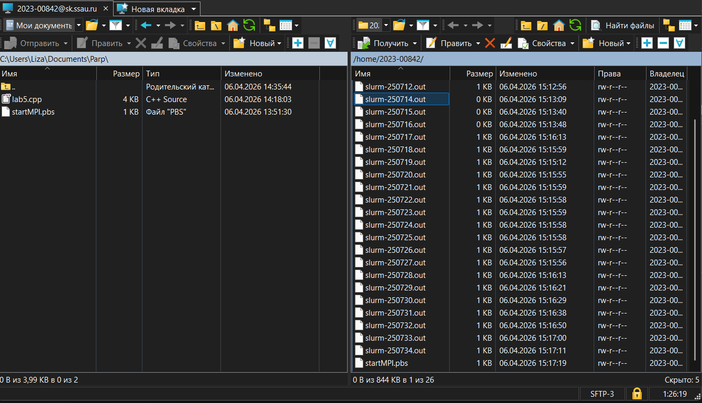
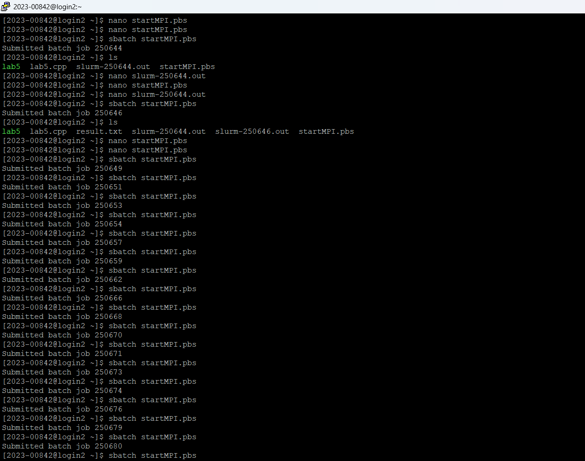
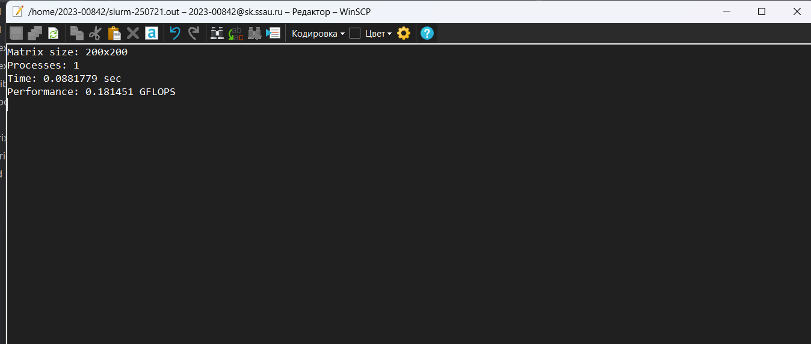
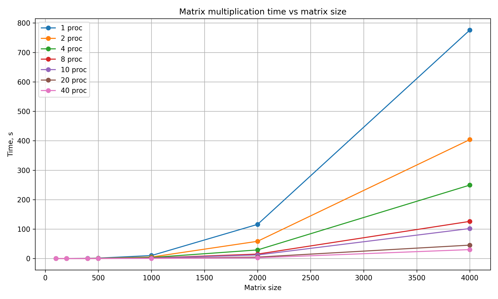

# Задание на лабораторную работу 5

 Параллельную версию программы на MPI необходимо также запустить на суперкомпьютере «Сергей Королёв».

---

## Ход работы

В ходе лабораторной работы я запустил программу из 3 лабы на
суперкомпьютере "Сергей Королёв"

Для начала я подключился к суперкомпьютеру при помощи PyTTy и при помощи
WinSCP

Файлы в WinSCP

Далее сформировал файл `startMPI.pbs`

Скомпилировав лабу при помощи

`mpicxx -std=c++11 lab5.cpp -o lab5`

Я поставил в очередь на запуск программу:

Вывод с суперкомпьютера:

### Краткое описание работы main.cpp

Программа инициализирует MPI, получает номер процесса и общее число процессов. Главный процесс генерирует две квадратные матрицы заданного размера и рассылает их всем остальным через MPI_Bcast. После этого строки результирующей матрицы делятся между процессами, и каждый процесс вычисляет свою часть произведения. Затем главный процесс собирает все вычисленные строки, сохраняет результат в файл result.txt и выводит время выполнения, число процессов и производительность программы.

## Тесты

| Кол-во процессов | 100         | 200         | 400         | 500         | 1000        | 2000        | 4000        |
| ---------------- | ----------- | ----------- | ----------- | ----------- | ----------- | ----------- | ----------- |
| 1 процесс        | 1,33369E-02 | 8,81779E-02 | 7,17215E-01 | 1,42545E+00 | 1,01197E+01 | 1,15979E+02 | 7.761000e+02           |
| 2 процесса       | 7,25198E-03 | 4,45030E-02 | 3,61190E-01 | 7,17889E-01 | 5,06289E+00 | 5,85572E+01 | 4.040000e+02           |
| 4 процесса       | 4,90093E-03 | 2,34752E-02 | 1,83422E-01 | 3,63332E-01 | 3,49063E+00 | 2,92223E+01 | 2,49452E+02 |
| 8 процессов      | 3,16286E-03 | 1,33610E-02 | 9,45470E-02 | 1,90100E-01 | 1,86356E+00 | 1,50731E+01 | 1,26193E+02 |
| 10 процессов     | 2,07400E-03 | 1,09172E-02 | 7,71592E-02 | 1,65378E-01 | 1,49321E+00 | 1,21330E+01 | 1,01921E+02 |
| 20 процессов     | 1,13606E-03 | 6,05607E-03 | 4,22211E-02 | 7,36392E-02 | 6,18016E-01 | 4,80448E+00 | 4,55544E+01 |
| 40 процессов     | 1,41907E-03 | 5,18799E-03 | 2,04201E-02 | 4,13480E-02 | 3,20191E-01 | 2,47015E+00 | 3,03705E+01 |

---
## Графики

График зависимости времени, затраченного на перемножение матриц
По вертикали время, каждая точка - увеличение количества потоков
по горизонтали размер

---

## Выводы по экспериментам

Смотря на таблицу и графики, можно понять, что при малом количестве операций многопоточность
слабо влияет на время выполнения программы

Напротив, при большом количестве данных - время, затраченное на перемножение матриц уменьшается
с увеличением числа процессов

Если сравнить суперкомпьютер с моим пк (данные для моего пк
есть в репозитории на гитхабе), то получим, что суперкомпьютер
эффективнее выполняет перемножение матриц на MPI

---

## Итоги

В ходе работы я научился работать с суперкомпьютером "Сергей Королев",
компилировать и запускать на суперкомпьютере свои программы.
Также удалось сравнить эффективность суперкомпьютера со своим компьютером 